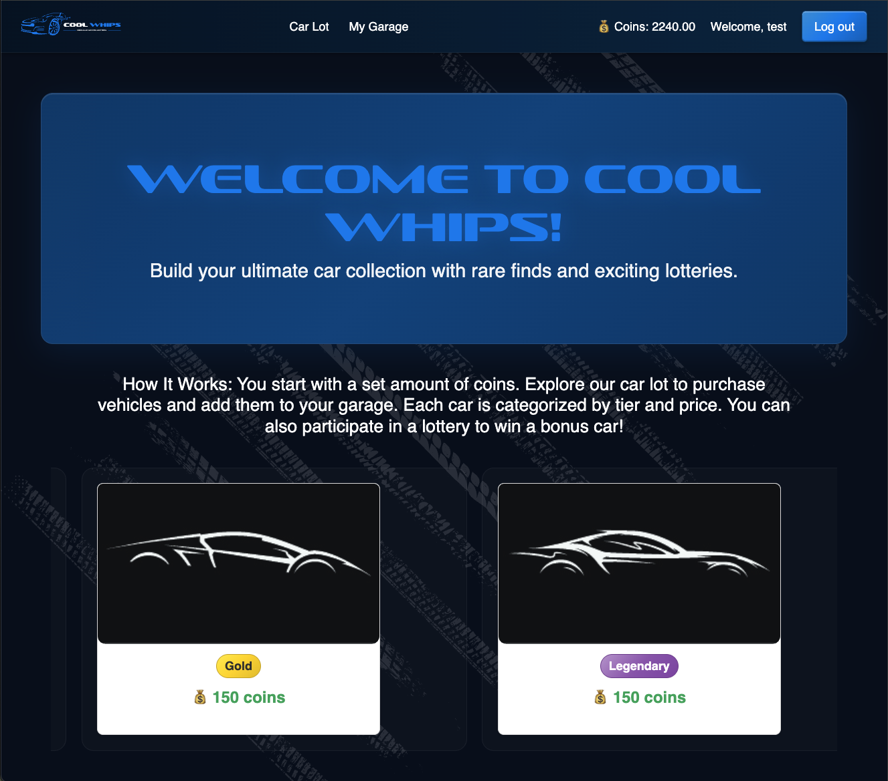
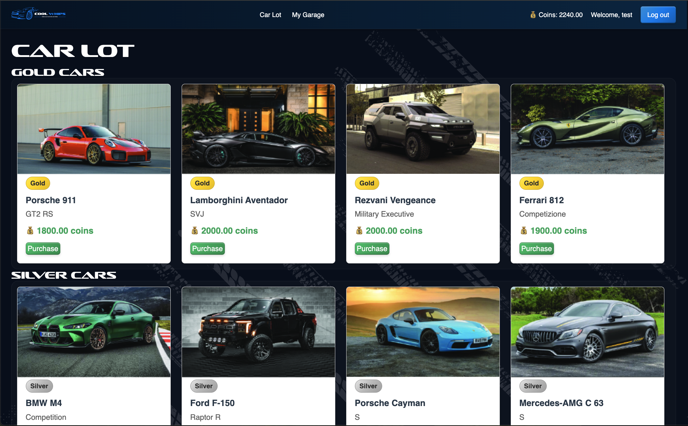

# Cool Whips

## Description

Cool Whips is a web application where users can build their dream car collection when they select from a lot of cars to add to their garage. Each new user begins with set number of coins. They can use the coins to ‘buy’ cars to add to their garage. Cars are categorized by tiers, and each tier has a price range. Users can ‘sell’ cars back (delete) for the depreciated value. Users can play a one-time lottery to win an unlisted, Legendary car.

## Table of Contents

- [Deployed App](#deployed-app)
- [Technologies Used](#technologies-used)
- [Features](#features)
- [Planning](#planning)
- [User Stories](#user-stories)
- [Project Next Steps](#project-next-steps)
- [About the Author](#about-the-author)
- [Works Cited](#works-cited)

## Deployed App

You can view the live application [here](https://coolwhips-5909dc009b5a.herokuapp.com/).

## Technologies Used

- **Frontend:** HTML, CSS, JavaScript
- **Backend:** Django, Pythonpip
- **Database:** PostgreSQL
- **Authentication:** Django's built-in authentication system with a custom user model
- **Additional Tools:** Git, GitHub for version control; virtual environments for dependency management

## Features

- **User Authentication:** Secure signup/login processes.
- **Car Lot:** Browse cars grouped by tiers (Legendary, Gold, Silver, Bronze) with purchase functionality.
- **Garage:** View purchased cars organized by tier with options to sell vehicles.
- **Responsive Design:** User-friendly interface across devices.
- **Admin Panel:** Manage user accounts and car data through Django admin.

## Planning

- **Wireframe:** View the project wireframe [here](planning/wireframe.html).
- **ERD:**  
  

## User Stories

- **As a user,** I want to sign up for an account so that I can purchase and manage cars.
- **As a user,** I want to view the available car lot so that I can see the different vehicles offered.
- **As a user,** I want to purchase a car so that it is added to my garage.
- **As a user,** I want to view my garage so that I can see all the cars I own.
- **As a user,** I want to sell a car so that I can regain my coins.

## Project Next Steps

- **Enable One-time Lottery:** Integrate lottery feature for users to win a Legenday Whip.
- **User Reviews and Ratings:** Allow users to review the cars.
- **Wishlist Feature:** Enable users to bookmark cars they are interested in.
- **Improved UI/UX:** Further polish the interface for a smoother experience.

## About the Author

I build applications and mini projects tied to my various interests. I enjoy design the most, but am most intriqued by how and why things work. I've worked as a self-taught front-end developer for almost a decade, but endevoured to learn software engineering, but want to dabble in data science, machine learning, deep learning, and eventually AI engineering.

## Works Cited

- [Django Documentation – Customizing Authentication](https://docs.djangoproject.com/en/stable/topics/auth/customizing/)
- [LearnDjango: Django Custom User Model Tutorial](https://learndjango.com/tutorials/django-custom-user-model)
- [GeeksforGeeks: Creating Custom User Model using AbstractUser in Django](https://www.geeksforgeeks.org/creating-custom-user-model-using-abstractuser-in-django_restframework/)

- [Django Documentation – How to provide initial data for models](https://docs.djangoproject.com/en/5.2/howto/initial-data/)
- [Django Documentation – Migrations](https://docs.djangoproject.com/en/5.2/topics/migrations/#data-migrations)
